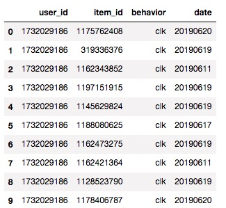
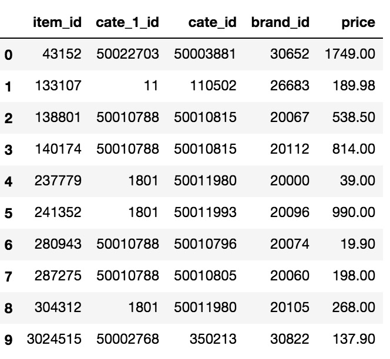
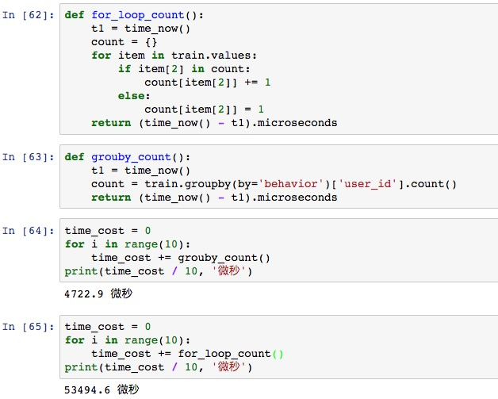
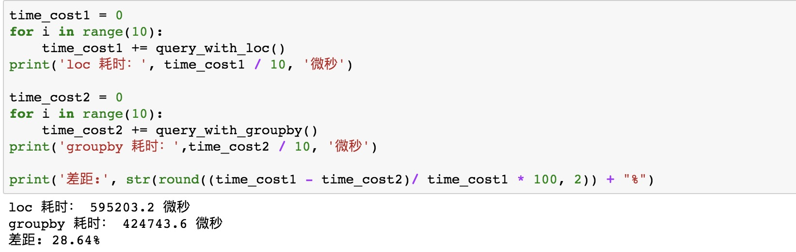
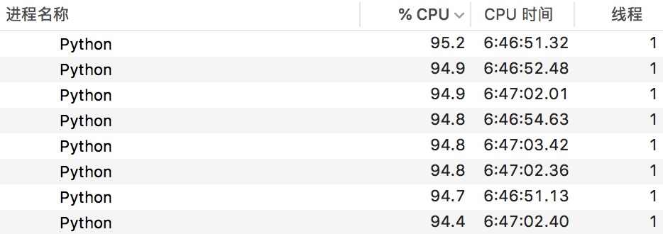
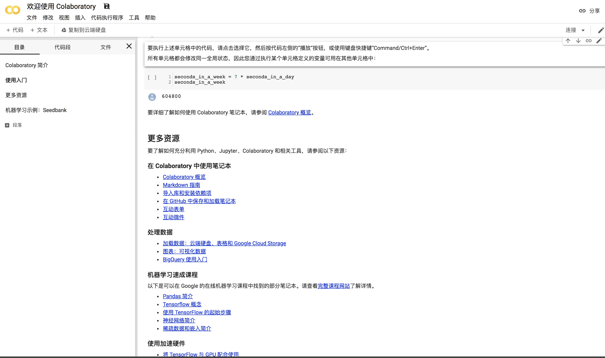

# Python 加速计算密集型任务经验总结

上一篇文章总结了[Python在IO密集型任务中的加速经验](http://www.xiaomaidong.com/?p=1189)，这篇文章则介绍如何在计算密集型任务中进行加速。

最近做了很多数据处理的工作，数据大小从几十M到几个G不等，刚开始做的时候一不小心就发现可能要几十甚至几百个小时才能处理完，于是找了很多方法对代码进行优化，最成功的一次优化是将大约需要200个小时的任务优化到只需要约6小时。优化的思路主要分为两个部分，一是合理使用Pandas,二是多进程。

此外，加速python可能很多人会想到使用pypy代替CPython来做编译，然而在实际工作中，我发现pypy并不适用于大量使用了pandas的项目，所以这里不再讨论相关内容。

本文所使用的jupyter notebook可以[在这里下载]()

### 数据集介绍

为了更直观的让大家感受到速度的差异，这里使用两个小数据集，分别是train和item_feature.

train, 3.6M，其前10条数据如图,记录的是用户对商品(item_id)的行为，前10条数据如图：

item_feature,3.9M，其前10条数据如图，记录的是商品的属性，前10条数据如图：

### 1.合理使用Pandas

##### 1.1 尽量避免使用for循环，在不得不使用for循环之前，一定要问一下自己，真的没有办法了吗？

举一个简单的例子，统计train中behavior的种类和数量，分别使用for循环和pandas 的groupby跑十次，所花费的平均时间分别是53494.6微秒和4722.9微秒，差距超过13倍。两种代码的算法原理大致一样，但pandas的底层是c语言并做了很多优化，所以快很多。

其实这里可以推广一下，就是，能用pandas的API搞定的事情就不要手写代码，只是pandas的API真的太多了，后面可以慢慢写一些骚操作总结。

##### 1.2 使用Hash代替链表查询

在不考虑空间复杂度的情况下，Hash查询的时间复杂度为O(1), 链表查询的时间复杂度为O(n),但是在pandas中，如何体现这一点呢？在大量使用查询的时候，用groupby代替loc。

举个例子，我想统计每个用户点过哪些品牌(brand_id)的商品，并为用户推荐这些品牌的所有商品，最终构造一个类似 {user_id: item_list}的字典。下面是两种实现方式：

首先，我们做一些基本操作，将train中的item\_id替换为brand\_id，并做几个groupby，为后续做准备。

	item_cate_group = item_feature.groupby('item_id')
	def replace_item_with_target(item_id, cluster_target):
    	try:
        	return item_cate_group.get_group(item_id)[cluster_target].values[0]
    	except KeyError:
        	return -1
	train['brand_id'] = train['item_id'].apply(lambda x: replace_item_with_target(x, 'brand_id'))
	train.drop(train[train['brand_id'] == -1].index, inplace=True)
	user_group = train.groupby(['user_id'])
	user_set = user_group.user_id.indices.keys()
	brand_item_group = item_feature.groupby('brand_id')
	user_dict = {}
	
- 1.使用loc做查询的函数：

		def query_with_loc():
		    t1 = time_now()
		    # 这里的for循环就是不得不用...
		    for user in user_set:
		        brand_id_list = user_group.get_group(user)['brand_id'].values
		        # 这里如果不用isin()，用for循环的话，速度又会慢很多
		        temp_df = item_feature.loc[item_feature.brand_id.isin(brand_id_list)]['item_id']
		        # 将int64转化为int，因为int64不可hash
		        item_list = list(map(int, temp_df.values))
		        user_dict[user] = item_list
		    return (time_now() - t1).microseconds

- 2.使用groupby做查询的函数:

		def query_with_groupby():
		    t1 = time_now()
		    for user in user_set:
		        brand_id_list = user_group.get_group(user)['brand_id'].values
		        item_list = []
		        # 这里的for循环也是不得不用...
		        for brand in brand_id_list:
		            item_list += list(brand_item_group.get_group(brand)['item_id'])
		        user_dict[user] = list(map(int, item_list))
		    return (time_now() - t1).microseconds

- 3.分别跑10次，结果如下：
	
使用了grouby查询的效率提高了28.64%，虽然不是很明显，但是！随着数据集的增大，使用loc这一句所消耗的时间将线性增加，而groupby查询的时间将保持不变！

### 2.多进程加速

Python因为有全局解释锁，所以多线程在计算密集型任务中没有意义，但是多进程依然可以发挥作用。

##### 多进程数量设置

多进程的数量要参考CPU的核心进行设置，比如我的电脑是4核8线程(相当于8个模拟核心)，一个进程基本上能跑满一个cpu核心，所以我最多开8个进程，通过任务管理器可以发现，如果进程数量超过8之后，每个核心的使用率就开始下降。

但是有时候在程序中，并不是每个进程每时每刻都在执行计算任务，所以这种情况下，为了更有效的利用资源，进程的数量可以设置为 CPU核心数量 + 1。基本上，有多少个CPU核心，多进程就可以将计算效率提高多少倍。

##### 多进程中的通信与数据共享

这是多进程比较麻烦的一点，python通过multiprocessing开启进程时，有一次传递参数的机会，但是在进程开启之后，要再通信就很麻烦了。多线程之间可以通过全局变量或类的变量(self.XXX)来完成数据共享，但是多进程却不行。幸好multiprocessing 提供了一种Manager类，可以完成多个进程间的数据共享。

相关的博客已经挺多的了，就不再复述了....关键字：multiprocessing Manager

以下为一个简单的Manager例子，开启10个进程，全部进程将计算的结果保存在同一个字典中：

		from multiprocessing import Manager
		from multiprocessing import Process
		
		def target_func(i):
		    d[i] = 1
		
		if __name__=="__main__":
		    m=Manager()
		    # 使用Manager创建字典
		    d=m.dict({})
		    P=[]
		    for i in range(10):
		        p=Process(target=target_func,args=[i])
		        # 非守护进程，即主进程会等待子进程结束
		        p.daemon = True
		        P.append(p)
		    # 开始进程
		    [p.start() for p in P]
		    # 等待子进程结束
		    [p.join() for p in P]
		    print(d)

当然，还有一种简单方式，将计算的结果保存为中间文件，最终在所有进程结束之后再更新一遍文件，这种方法也是非常简单暴力的。只是有的时候，会发现写个文件都要几个小时，就很难受。。。如果内存够大的话，可以使用基于内存的NoSQL数据库，比如Redis，将中间结果保存在redis中，这样就会快很多。

### 总结

em。。。服务器是个好东西，在执行这种长时间的计算任务的时候，放到服务器上跑起来，自己的电脑就解放了～

另外，Google的Colaboratory也很不错，是一个在线的jupyter notebook,可以免费执行很多计算任务，也可以用谷歌的GPU（就是说可以用来跑模型），划重点——免费！！ 

[Google Colabratory地址](https://colab.research.google.com/notebooks/welcome.ipynb#scrollTo=-Rh3-Vt9Nev9)

但是在执行计算的时候，jupyter不能关闭，并且由于网络问题，常常连接中断....

当然这些问题都不致命，致命的问题是，我传了一个8个G的数据上去，然后它崩了...

